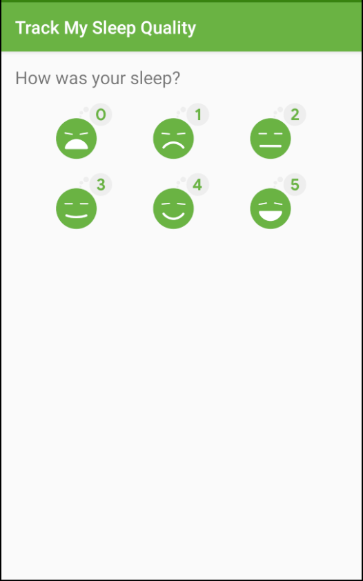

## @Volatile(annotation)
@Volatile provides memory visibility and guarantee that the value is being read,
comes from main-memory and not the cpu-cache, so the value in cpu-cache is always
considered to be dirty and it has to be fetched again

## synchronized
Wrapping a block of code into synchronized, means only a one thread of execution at a time can enter in this block of code

# Coroutines

## Coroutines characteristics
They are 

1- Asynchronous
    The coroutines runs independently from the main execution steps of your program. This could be in parallel on a separate processor
2- Non-Blocking
    The system is not blocking the main or UI thread.
3- Sequential code(using suspend functions)

## Coroutines need...

To use coroutines in kotlin you need following pieces

1-Job
    A background job. Conceptually, is a cancelable thing with a life-cycle that culminates in its completion.
2-Dispatcher
    The dispatcher sends off coroutines to run on a various threads.
3-Scope
    The scope can combines information, including a job and dispatcher, to define the context in which the coroutine runs.

# Room - SleepQualityTracker app

This is the toy app for Lesson 6 of the [Android App Development in Kotlin course on Udacity](https://www.udacity.com/course/???).

## SleepQualityTracker

The SleepQualityTracker app is a demo app that helps you collect information about your sleep. 
* Start time
* End time
* Quality
* Time slept

This app demonstrates the following views and techniques:
* Room database
* DAO
* Coroutines

It also uses and builds on the following techniques from previous lessons:
* Transformation map
* Data Binding in XML files
* ViewModel Factory
* Using Backing Properties to protect MutableLiveData
* Observable state LiveData variables to trigger navigation

## Screenshots

